# AutoIdeas System Architecture

## Table of Contents
- [System Overview](#system-overview)
- [Data Flow](#data-flow)
- [Component Interactions](#component-interactions)
- [Workshop Configuration](#workshop-configuration)
- [Deployment Architecture](#deployment-architecture)
- [Processing Pipeline](#processing-pipeline)
- [API Architecture](#api-architecture)

## System Overview

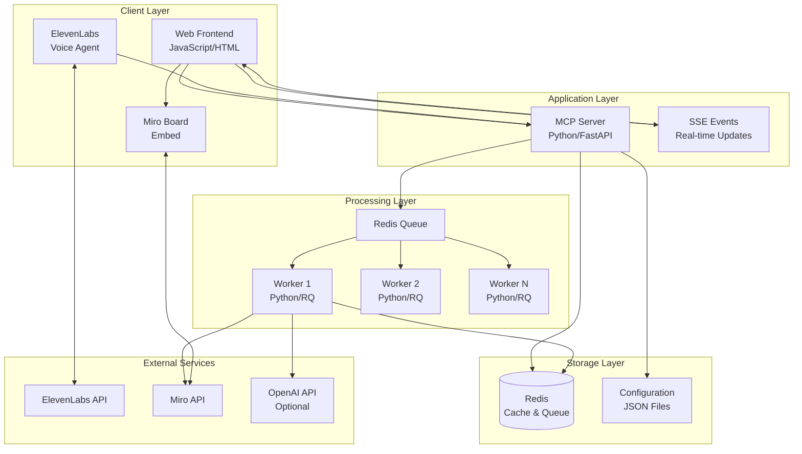

## Data Flow

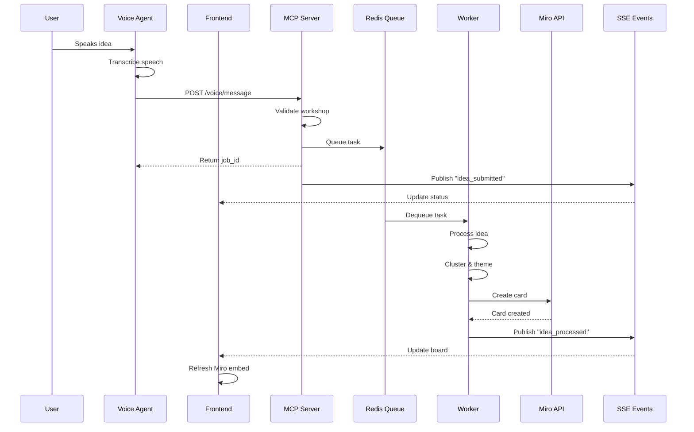

## Component Interactions

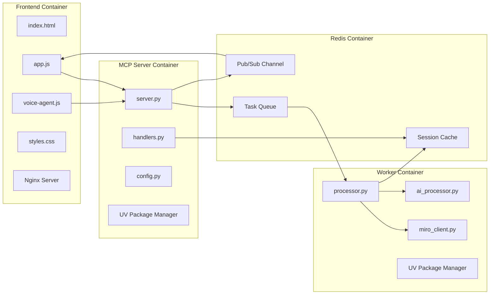

## Workshop Configuration

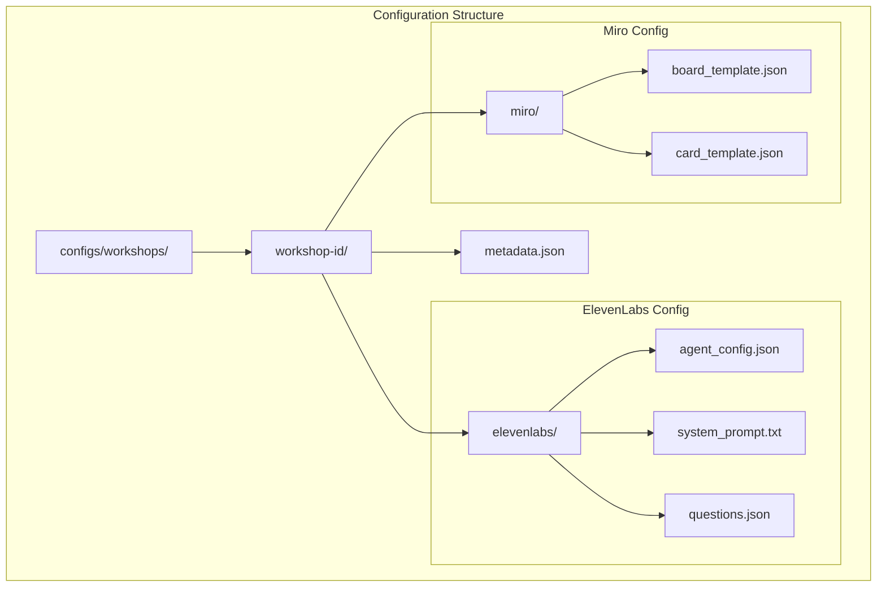

## Deployment Architecture

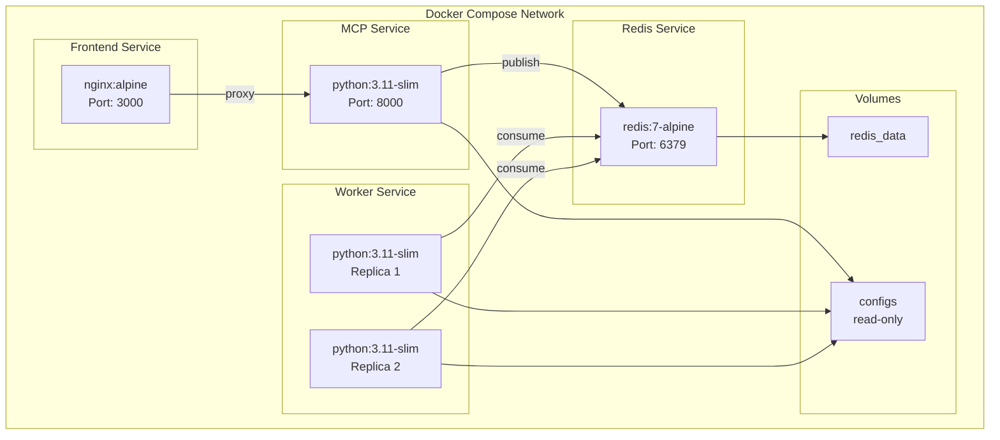

## Processing Pipeline

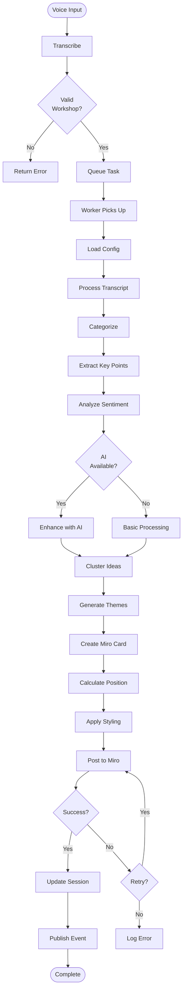

## API Architecture

```mermaid
graph LR
    subgraph "REST Endpoints"
        GET1[GET /]
        GET2[GET /workshops]
        GET3[GET /workshops/{id}]
        GET4[GET /status]
        POST1[POST /voice/message]
        POST2[POST /mcp/tools/{tool}]
    end
    
    subgraph "SSE Endpoints"
        SSE1[GET /sse/events]
    end
    
    subgraph "Event Types"
        E1[connected]
        E2[idea_submitted]
        E3[idea_processed]
        E4[processing_error]
        E5[session_updated]
    end
    
    subgraph "MCP Tools"
        T1[submit_idea]
    end
    
    POST1 --> E2
    POST2 --> T1
    T1 --> E2
    
    SSE1 --> E1
    SSE1 --> E2
    SSE1 --> E3
    SSE1 --> E4
    SSE1 --> E5
```

## Message Flow States

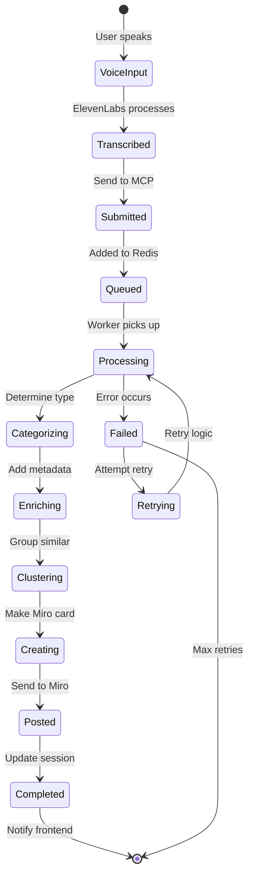

## Session Management

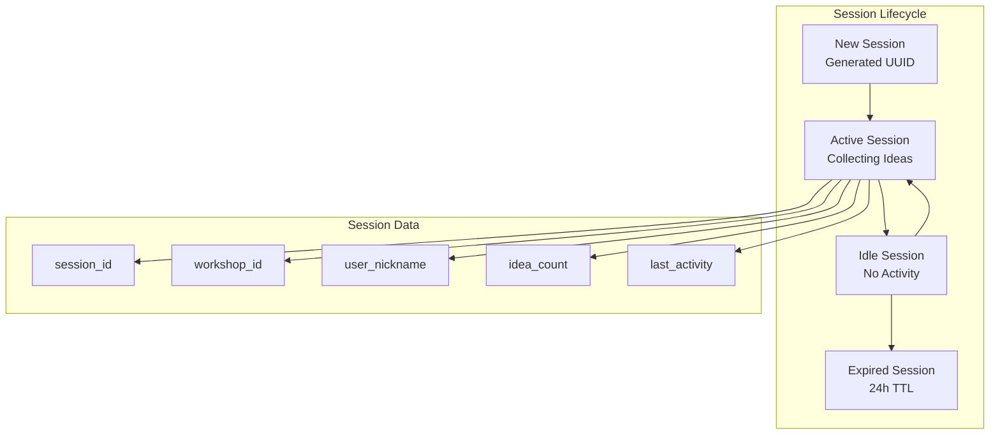

## Error Handling Flow

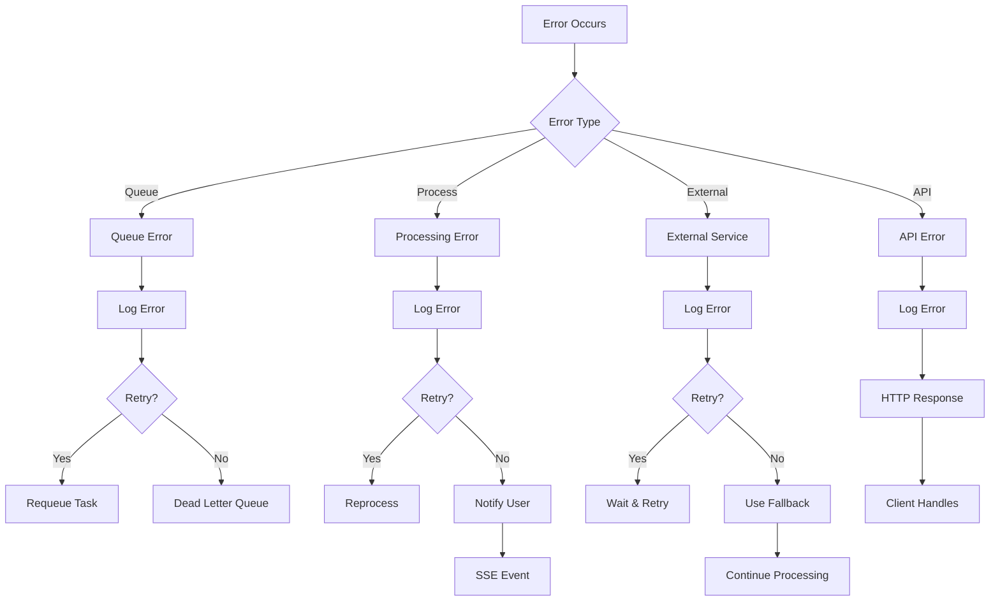

## Technology Stack

| Component | Technology | Purpose |
|-----------|------------|---------|
| Frontend | HTML/JS/CSS | User interface |
| Voice | ElevenLabs SDK | Voice interaction |
| Visualization | Miro Embed | Idea boards |
| API Server | FastAPI/Python | Request handling |
| Queue | Redis/RQ | Task management |
| Workers | Python/RQ | Background processing |
| AI | OpenAI/Scikit-learn | Idea enhancement |
| Container | Docker | Deployment |
| Package Mgmt | UV | Python dependencies |
| Web Server | Nginx | Static serving & proxy |

## Scaling Considerations

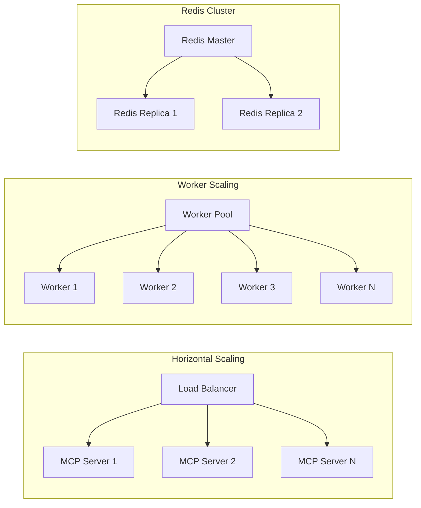

## Security Architecture

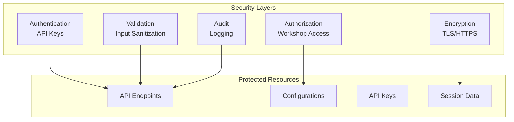